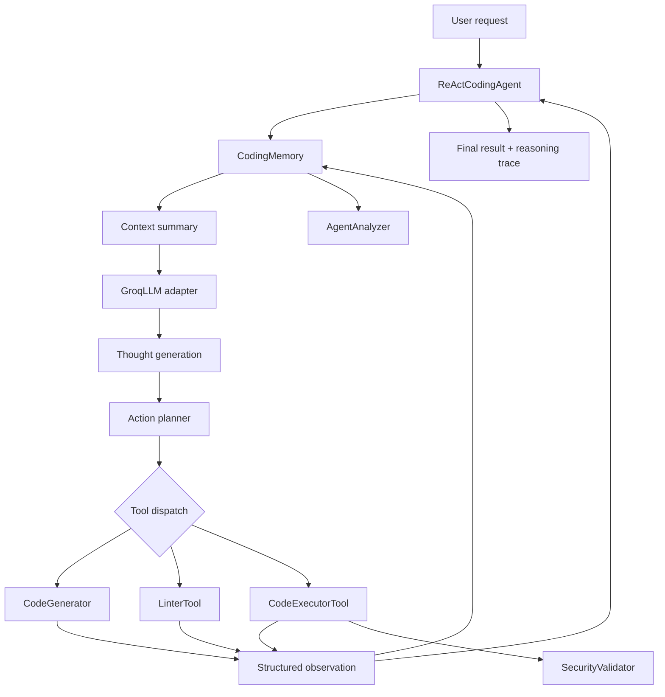

# Agentic AI Coding Assistant

> A transparent, tool-using coding agent that turns natural-language requests into generated, linted, executable Python workflows—while retaining session context, execution evidence, and performance signals.

[](https://www.python.org/)
[](https://jupyter.org/)
[](https://groq.com/)
[](#agent-architecture)

## Overview

`Agentic_AI_Coding_Assistant.ipynb` is a reference implementation of an agentic coding workflow rather than a single-shot chatbot. Given a natural-language programming request, the system maintains context, selects an appropriate tool, observes the result, and iterates toward a useful outcome.

The notebook demonstrates:

- LLM-backed code generation
- Short-term session memory and long-term preference/history memory
- AST-based Python syntax validation and lightweight style checks
- Captured code execution with isolated in-process namespace state
- A ReAct-style reasoning/action/observation loop
- Structured results for generated code, lint findings, execution output, and errors
- Performance reporting and security-behavior demonstrations

The design goal is **inspectable, extensible agent behavior**: each important step is represented as a tool, a result, or a memory update instead of being hidden behind an opaque chat response.

> **Current implementation scope:** the notebook is a prototype/reference architecture. The execution layer provides namespace isolation, output capture, and exception handling, but it is not yet an OS/container-grade security sandbox. See [Security model and limitations](#security-model-and-limitations).

## Why build a local coding agent?

General-purpose assistants such as Gemini or Claude are excellent conversational interfaces, but a coding agent embedded in your own workflow solves a different problem: **controlled, reproducible engineering execution**.

### The problem this project addresses

A chat-only coding experience commonly leaves the developer with four manual steps:

1. Translate a requirement into a prompt.
2. Copy generated code into a local environment.
3. Run it and interpret failures.
4. Return the failure context to the model and repeat.

That loop loses state, makes results difficult to reproduce, and separates reasoning from evidence. This project brings those steps into one explicit control loop:

```text
Natural-language request
        ↓
Context retrieval from memory
        ↓
LLM-generated thought and action plan
        ↓
Tool execution: generate → lint → execute
        ↓
Structured observation and error capture
        ↓
Memory update and bounded iteration
        ↓
Actionable result
```

### Why choose this architecture over a hosted chat app?

| Capability | Generic chat workflow | This project’s approach |
|---|---|---|
| **Control** | Provider-defined product workflow | You own the orchestration, tools, prompts, and stop conditions |
| **Transparency** | Reasoning may be difficult to operationalize | Thoughts, actions, observations, and iteration counts are recorded as structured state |
| **Integration** | Usually requires manual copy/paste or platform-specific extensions | Tools are ordinary Python classes that can be replaced or expanded |
| **Data boundary** | Depends on the provider’s application and settings | The control plane runs in your environment; only the configured LLM request leaves it |
| **Reproducibility** | Conversation context can be transient | Session state, generated artifacts, errors, and preferences are explicitly tracked |
| **Vendor flexibility** | Tied to a particular product experience | Uses an OpenAI-compatible HTTP endpoint and can be adapted to another provider or local model server |
| **Engineering feedback** | Code generation is often the end of the workflow | Linting, execution, output capture, and error analysis are first-class stages |
| **Cost and deployment** | Product subscription or usage model | You choose the model endpoint, request budget, and deployment environment |

This is not an argument that a local agent always replaces a frontier assistant. Hosted assistants may provide stronger models, broader context windows, multimodal capabilities, and mature developer tooling. The value here is **ownership of the engineering loop**: policy, execution, observability, memory, and integration can evolve with the repository.

> In the current notebook, the agent’s control plane is local, but the default model call goes to Groq’s API. To make the system fully local, point the same client contract at a self-hosted OpenAI-compatible model server.

## System architecture



## Agent architecture

### 1. `GroqLLM`: provider adapter

The `GroqLLM` class isolates provider-specific communication from the rest of the agent:

- Uses the OpenAI-compatible chat-completions endpoint at `https://api.groq.com/openai/v1/chat/completions`.
- Sends system/user messages, temperature, and a bounded token budget.
- Uses `openai/gpt-oss-20b` as the configured model in the notebook.
- Extracts assistant content, with a fallback for responses that expose a reasoning field.
- Converts HTTP/API failures into readable error strings so the outer agent can continue observing failure states.

This adapter boundary is intentionally small. A future implementation can replace it with a local model server, another API provider, or a mocked deterministic client for tests without rewriting the tools or agent loop.

### 2. `CodingMemory`: dual-layer memory

`CodingMemory` provides explicit state rather than relying only on the model’s context window.

**Short-term session context** tracks:

- Current task
- Generated code blocks
- Execution results
- Errors encountered
- Variables currently visible to the executor

**Long-term coding history** stores:

- Successful patterns
- Frequent errors
- User preferences, including coding style and preferred libraries
- Session count
- Timestamps for stored history entries

`get_context_summary()` compresses this state into a prompt-ready representation. This gives the LLM relevant context while keeping the control loop responsible for what is persisted and exposed.

### 3. `CodeGenerator`: constrained code generation

`CodeGenerator.generate_code()`:

- Accepts a natural-language description and target language.
- Retrieves the current memory summary.
- Uses a system prompt that requests clean, readable, commented code with appropriate error handling.
- Requests code-only output to reduce prose contamination.
- Removes Markdown code fences if the model returns them anyway.
- Records the generated artifact, language, description, and timestamp in session memory.
- Returns a structured success/error object instead of only raw text.

### 4. `LinterTool`: AST and style feedback

`LinterTool.lint_code()` currently supports Python and returns structured findings.

It performs:

- `ast.parse()` syntax validation
- Syntax error line numbers and messages
- Line-length checks for lines over 100 characters
- A lightweight function-docstring check
- Severity labels: `error`, `warning`, and `info`
- Memory updates so lint findings become part of the next agent context

The linter is deliberately dependency-light and explainable. It is not a replacement for Ruff, Pylint, mypy, Bandit, or a full static-analysis pipeline; those tools are natural production extensions.

### 5. `CodeExecutorTool`: observable execution

`CodeExecutorTool.execute_code()` demonstrates an execution boundary for Python snippets:

- Rejects unsupported languages.
- Executes code in a dedicated namespace dictionary.
- Captures `stdout` and `stderr` separately.
- Measures elapsed execution time.
- Returns success state, output, errors, execution time, and visible variable names.
- Preserves execution results and variable-type summaries in memory.
- Catches syntax/runtime exceptions and returns them as structured failures.
- Restores the original output streams in a `finally` block.

The separation of `stdout` and `stderr` matters for agent systems: expected program output can remain machine-readable while diagnostics and warnings remain available for debugging.

### 6. `ReActCodingAgent`: bounded tool orchestration

`ReActCodingAgent` implements a bounded reasoning/action/observation loop:

1. Generate a concise thought about the next step.
2. Plan one action as JSON: `generate_code`, `lint_code`, `execute_code`, or `complete`.
3. Dispatch the action to the corresponding tool.
4. Record the observation and a compact recent trace.
5. Continue until the task is complete or `max_iterations` is reached.

The default maximum is five iterations. This bound is important for cost control, predictable latency, and avoiding open-ended agent loops.

The planner includes a fallback strategy: if JSON parsing fails, it uses keyword detection and ultimately defaults to code generation. That makes the prototype more resilient to imperfect model formatting, while also making the planner behavior inspectable and easy to harden with schema validation later.

### 7. `AgentAnalyzer`: operational visibility

`AgentAnalyzer` produces a compact performance report containing:

- Total code generations
- Total executions
- Successful executions
- Execution success rate
- Average execution time
- Error counts grouped by type
- Number of variables in scope
- Approximate context size

These metrics are intentionally simple but establish the foundation for tracing, evaluation datasets, regression tests, and production telemetry.

### 8. `SecurityValidator`: behavior demonstrations

`SecurityValidator` exercises the executor against:

- Malformed syntax
- Runtime exceptions such as division by zero
- Safe code that produces output
- Namespace-isolation behavior

The notebook’s recorded demonstrations show graceful failure handling, successful output capture, and state isolation between the executor namespace and the surrounding notebook namespace.

## LLM strategies used

The notebook uses several practical strategies for agentic coding:

- **Role separation:** system prompts define the generator, reasoning engine, and action planner as different responsibilities.
- **Low temperature:** `0.1` is used for more repeatable coding and planning behavior.
- **Context retrieval:** memory summaries and recent trace steps are injected into prompts instead of replaying unlimited history.
- **Action vocabulary:** the planner is constrained to a small set of explicit actions.
- **Structured action output:** the planner is asked to return JSON with `action`, `parameters`, and `reasoning`.
- **Bounded autonomy:** the loop stops after a fixed number of iterations.
- **Observation-driven refinement:** tool results are returned to the agent rather than assuming generation succeeded.
- **Graceful degradation:** malformed planner output, API errors, and execution errors are represented as recoverable results.
- **Separation of concerns:** model interaction, memory, tools, orchestration, and analysis are implemented as separate components.

## Security model and limitations

### What the notebook does today

- Keeps the API key in environment variables rather than hard-coding it in the notebook.
- Avoids embedding the secret in prompts or generated artifacts.
- Uses a dedicated executor namespace rather than the notebook’s global namespace.
- Captures exceptions instead of allowing a failed snippet to crash the orchestration layer.
- Separates standard output from diagnostics.
- Demonstrates syntax-error, runtime-error, and namespace-isolation handling.
- Limits agent iterations to reduce runaway requests.

### Important limitation

Python `exec()` with a separate dictionary is **not a secure sandbox against malicious code**. Generated code can still potentially access imports, filesystem resources, network resources, processes, or consume excessive CPU/memory. Namespace separation is useful for state hygiene, not a complete security boundary.

For production use, execute untrusted or model-generated code in a defense-in-depth environment such as:

- A disposable container or microVM
- A non-root user with a read-only filesystem
- Network egress disabled by default
- Explicit filesystem and secret mounts
- CPU, memory, process-count, and wall-clock limits
- Seccomp/AppArmor or an equivalent policy layer
- Ephemeral workspace cleanup after each run
- Approval gates for file writes, shell commands, network calls, and package installation
- Audit logging and redaction of secrets

## Current strengths and next steps

### Strengths demonstrated by the prototype

- Clear separation between model, memory, tools, orchestration, and analytics
- Small, understandable interfaces that are easy to extend
- Structured result objects instead of untracked text-only output
- Bounded ReAct loop with explicit action dispatch
- Lightweight syntax/style feedback before execution
- Error and performance state carried across the workflow
- Provider adapter that can be replaced without changing the agent design

### Recommended production hardening

1. Replace ad-hoc planner parsing with strict JSON Schema validation.
2. Add retry/backoff for transient provider errors and rate limits.
3. Add idempotency keys and request budgets.
4. Move execution into a container/microVM with resource and network policies.
5. Add Ruff, Bandit, mypy/pyright, and project-specific tests.
6. Add unit tests for every tool and integration tests for the ReAct loop.
7. Add a persistent, privacy-aware memory store with retention controls.
8. Redact secrets and sensitive code before external model calls.
9. Add human approval for destructive or externally visible actions.
10. Add evaluation suites for correctness, security, latency, cost, and tool-selection accuracy.
11. Fix the notebook’s kernel metadata to reflect the intended supported Python version.
12. Separate the implementation into importable Python modules and keep the notebook as an executable demonstration.

## Getting started

### Prerequisites

- Python 3.10 or newer recommended
- Jupyter Notebook or JupyterLab
- A Groq API key for the default configuration

### Installation

```bash
python -m venv .venv
source .venv/bin/activate          # Windows: .venv\\Scripts\\activate
python -m pip install --upgrade pip
pip install jupyter python-dotenv requests
```

### Configure the API key

Create a `.env` file in the repository root:

```dotenv
GROQ_API_KEY=your_groq_api_key_here
```

Never commit `.env` or API keys. Add this to `.gitignore`:

```gitignore
.env
.venv/
__pycache__/
.ipynb_checkpoints/
```

### Run the notebook

```bash
jupyter notebook Agentic_AI_Coding_Assistant.ipynb
```

Run the setup and class-definition cells first, then execute the demonstration cells. The demo covers simple code generation, a more complex CSV/statistics request, performance analysis, and security-behavior checks.

## Repository structure

```text
.
├── Agentic_AI_Coding_Assistant.ipynb  # End-to-end implementation and demos
├── README.md                          # Project documentation
└── .env                               # Local secret; do not commit
```

As the project matures, a recommended modular structure is:

```text
src/agent/
├── llm.py          # Provider/model adapter
├── memory.py       # Session and persistent memory
├── tools.py        # Generator, linter, executor
├── agent.py        # ReAct orchestration
├── security.py     # Policy and execution boundary
└── telemetry.py    # Metrics and traces
```

## Example requests

The notebook demonstrates requests such as:

```text
Create a Python function that calculates the palindrome of a number.
```

and:

```text
Create a Python function that reads a CSV file and calculates statistics, then test it with sample data.
```

The second request illustrates how an agent can decompose a more complex goal and coordinate generation, linting, and execution-oriented tools.

## Engineering principles

- **Explicit state beats hidden state.** Memory and traces are visible data structures.
- **Tools should be replaceable.** Each capability has a focused interface.
- **Every action should produce evidence.** Results include status, output, errors, and timing where relevant.
- **Autonomy must be bounded.** Iteration limits and approval gates are part of the design.
- **Security claims must match the implementation.** Namespace isolation is useful, but not equivalent to a container boundary.
- **Local control enables iteration.** Prompts, policies, models, telemetry, and integrations can evolve with the codebase.

## Disclaimer

This repository is an educational and portfolio-quality prototype. Do not execute untrusted or model-generated code on a production host without implementing a real isolation boundary and reviewing the security model for your deployment.

## License

Add the license that matches your intended use before publishing this repository. For a permissive open-source portfolio project, MIT is a common choice; consult your organization or project requirements before selecting one.
